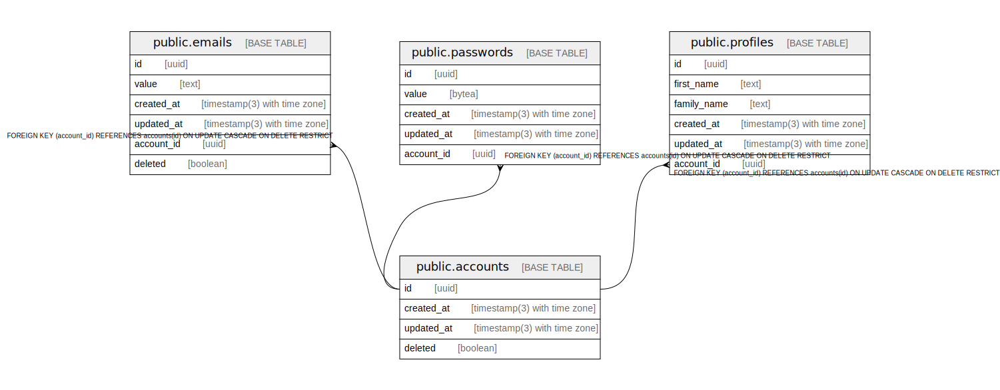

# postgres

## Tables

| Name | Columns | Comment | Type |
| ---- | ------- | ------- | ---- |
| [public.accounts](public.accounts.md) | 4 |  | BASE TABLE |
| [public.emails](public.emails.md) | 6 |  | BASE TABLE |
| [public.passwords](public.passwords.md) | 5 |  | BASE TABLE |
| [public.profiles](public.profiles.md) | 6 |  | BASE TABLE |

## Relations

---

> Generated by [tbls](https://github.com/k1LoW/tbls)
