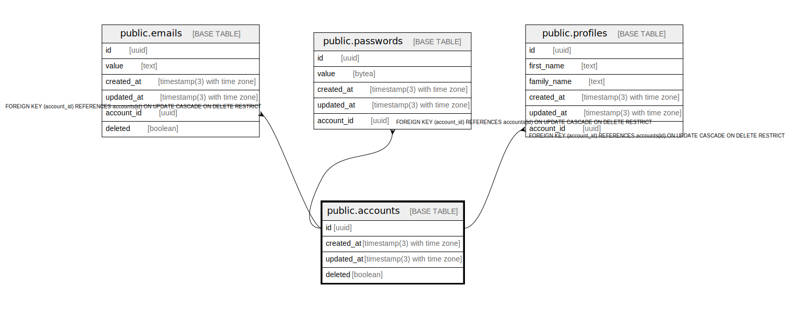

# public.accounts

## Description

## Columns

| Name | Type | Default | Nullable | Children | Parents | Comment |
| ---- | ---- | ------- | -------- | -------- | ------- | ------- |
| id | uuid | gen_random_uuid() | false | [public.emails](public.emails.md) [public.passwords](public.passwords.md) [public.profiles](public.profiles.md) |  |  |
| created_at | timestamp(3) with time zone | CURRENT_TIMESTAMP | false |  |  |  |
| updated_at | timestamp(3) with time zone | CURRENT_TIMESTAMP | false |  |  |  |
| deleted | boolean | false | false |  |  |  |

## Constraints

| Name | Type | Definition |
| ---- | ---- | ---------- |
| accounts_pkey | PRIMARY KEY | PRIMARY KEY (id) |

## Indexes

| Name | Definition |
| ---- | ---------- |
| accounts_pkey | CREATE UNIQUE INDEX accounts_pkey ON public.accounts USING btree (id) |

## Relations

---

> Generated by [tbls](https://github.com/k1LoW/tbls)
