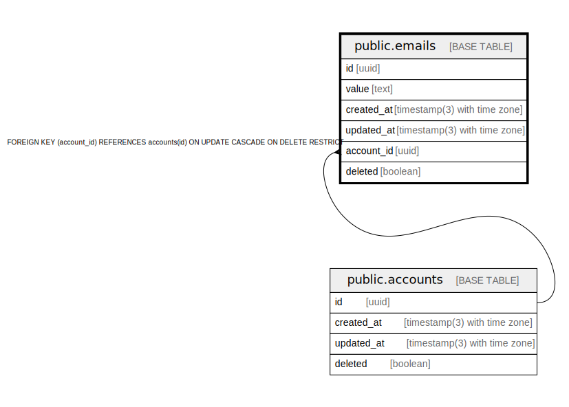

# public.emails

## Description

## Columns

| Name | Type | Default | Nullable | Children | Parents | Comment |
| ---- | ---- | ------- | -------- | -------- | ------- | ------- |
| id | uuid | gen_random_uuid() | false |  |  |  |
| value | text |  | false |  |  |  |
| created_at | timestamp(3) with time zone | CURRENT_TIMESTAMP | false |  |  |  |
| updated_at | timestamp(3) with time zone | CURRENT_TIMESTAMP | false |  |  |  |
| account_id | uuid |  | false |  | [public.accounts](public.accounts.md) |  |
| deleted | boolean | false | false |  |  |  |

## Constraints

| Name | Type | Definition |
| ---- | ---- | ---------- |
| emails_account_id_fkey | FOREIGN KEY | FOREIGN KEY (account_id) REFERENCES accounts(id) ON UPDATE CASCADE ON DELETE RESTRICT |
| emails_pkey | PRIMARY KEY | PRIMARY KEY (id) |

## Indexes

| Name | Definition |
| ---- | ---------- |
| emails_pkey | CREATE UNIQUE INDEX emails_pkey ON public.emails USING btree (id) |
| emails_account_id_idx | CREATE INDEX emails_account_id_idx ON public.emails USING btree (account_id) |
| emails_account_id_key | CREATE UNIQUE INDEX emails_account_id_key ON public.emails USING btree (account_id) |
| emails_value_idx | CREATE INDEX emails_value_idx ON public.emails USING btree (value) |
| emails_value_key | CREATE UNIQUE INDEX emails_value_key ON public.emails USING btree (value) |
| emails_value_not_deleted_idx | CREATE UNIQUE INDEX emails_value_not_deleted_idx ON public.emails USING btree (value) WHERE (NOT deleted) |

## Relations

---

> Generated by [tbls](https://github.com/k1LoW/tbls)
