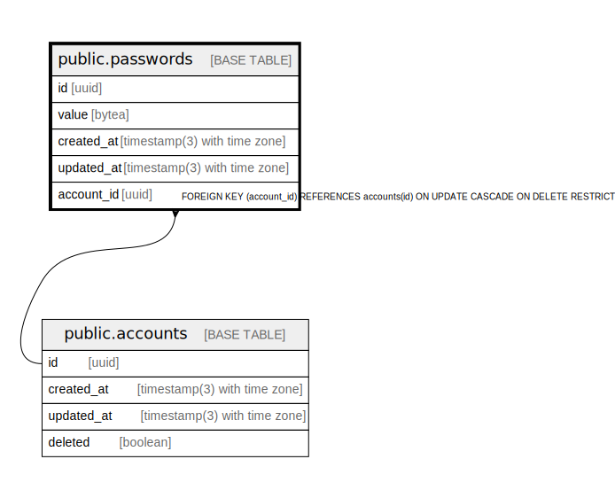

# public.passwords

## Description

## Columns

| Name | Type | Default | Nullable | Children | Parents | Comment |
| ---- | ---- | ------- | -------- | -------- | ------- | ------- |
| id | uuid | gen_random_uuid() | false |  |  |  |
| value | bytea |  | false |  |  |  |
| created_at | timestamp(3) with time zone | CURRENT_TIMESTAMP | false |  |  |  |
| updated_at | timestamp(3) with time zone | CURRENT_TIMESTAMP | false |  |  |  |
| account_id | uuid |  | false |  | [public.accounts](public.accounts.md) |  |

## Constraints

| Name | Type | Definition |
| ---- | ---- | ---------- |
| passwords_account_id_fkey | FOREIGN KEY | FOREIGN KEY (account_id) REFERENCES accounts(id) ON UPDATE CASCADE ON DELETE RESTRICT |
| passwords_pkey | PRIMARY KEY | PRIMARY KEY (id) |

## Indexes

| Name | Definition |
| ---- | ---------- |
| passwords_pkey | CREATE UNIQUE INDEX passwords_pkey ON public.passwords USING btree (id) |
| passwords_account_id_idx | CREATE INDEX passwords_account_id_idx ON public.passwords USING btree (account_id) |
| passwords_account_id_key | CREATE UNIQUE INDEX passwords_account_id_key ON public.passwords USING btree (account_id) |
| passwords_value_idx | CREATE INDEX passwords_value_idx ON public.passwords USING btree (value) |

## Relations

---

> Generated by [tbls](https://github.com/k1LoW/tbls)
