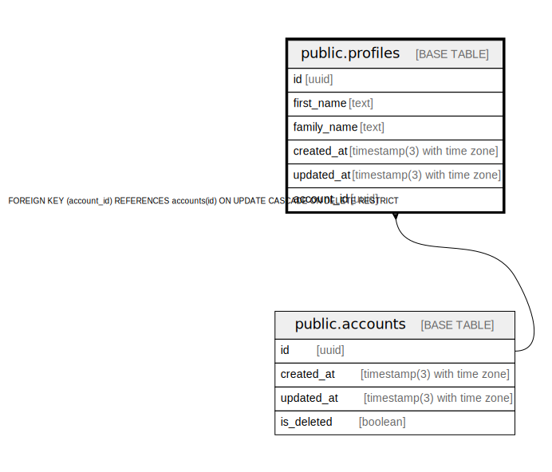

# public.profiles

## Description

## Columns

| Name | Type | Default | Nullable | Children | Parents | Comment |
| ---- | ---- | ------- | -------- | -------- | ------- | ------- |
| id | uuid |  | false |  |  |  |
| first_name | text |  | false |  |  |  |
| family_name | text |  | false |  |  |  |
| created_at | timestamp(3) with time zone |  | false |  |  |  |
| updated_at | timestamp(3) with time zone |  | false |  |  |  |
| account_id | uuid |  | false |  | [public.accounts](public.accounts.md) |  |

## Constraints

| Name | Type | Definition |
| ---- | ---- | ---------- |
| profiles_account_id_fkey | FOREIGN KEY | FOREIGN KEY (account_id) REFERENCES accounts(id) ON UPDATE CASCADE ON DELETE RESTRICT |
| profiles_pkey | PRIMARY KEY | PRIMARY KEY (id) |

## Indexes

| Name | Definition |
| ---- | ---------- |
| profiles_pkey | CREATE UNIQUE INDEX profiles_pkey ON public.profiles USING btree (id) |
| profiles_account_id_idx | CREATE INDEX profiles_account_id_idx ON public.profiles USING btree (account_id) |
| profiles_account_id_key | CREATE UNIQUE INDEX profiles_account_id_key ON public.profiles USING btree (account_id) |

## Relations

---

> Generated by [tbls](https://github.com/k1LoW/tbls)
